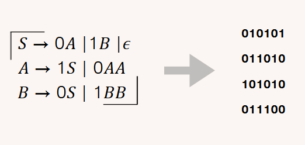
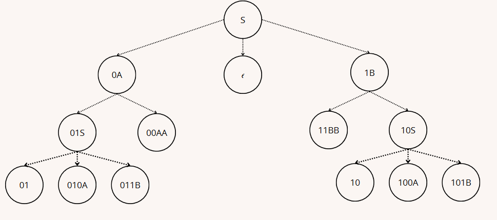

# Context-free String Generator

A context-free grammar is a set of recursive rules used to generate patterns of strings.  
In this project we made a program which spit out strings from context-free grammar

## Solution approach

To make a reasonably generation of strings, it was need to use the data struct N-ary tree and the breadth first search algorithm

Each branch of the tree is possible route for the generation and the nodes the state of the string. The tree grows following the breadth-first search concept, once a leaf is hitted we back-track the path done and it will be shown

By using this method we guarantee none of the branchs will be generated more than once

## How to use

There's an executable inside bin folder

To run the program call it from a terminal and pass a text file as a reference, example: CFString_Generator sample.txt

There're available two modes of execution

- **Fast One**: It uses the method previous explanned, you can generate as many strings as you want, or as many as the grammar (or your machine) is capable to do

- **Detail One**: Here you can choose which branch you want to follow. The program will ask what are the next derivation of the most left non-terminal symbol until it reach 0 non-terminals, that means a leaf node

## Issues

Beside the program avade generate repeted strings, this is only possible for non-ambiguos grammar. In an ambiguos grammar the same string could be generated from two or more sintatic trees, therefore our approach could not recoginize this scenario

## Additional information

That was a academic project made by [João Barreto](https://github.com/Jhn63) and [João Cirilo](https://github.com/jcirilo).  
We also made a [video](https://youtu.be/Ml0ykvG_4J8) where we explain and shows the project

If you have any question be free to contact me, thank you